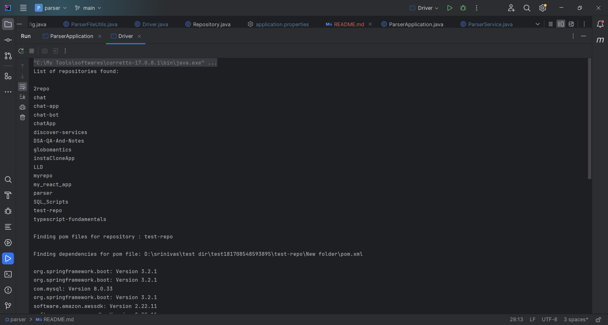
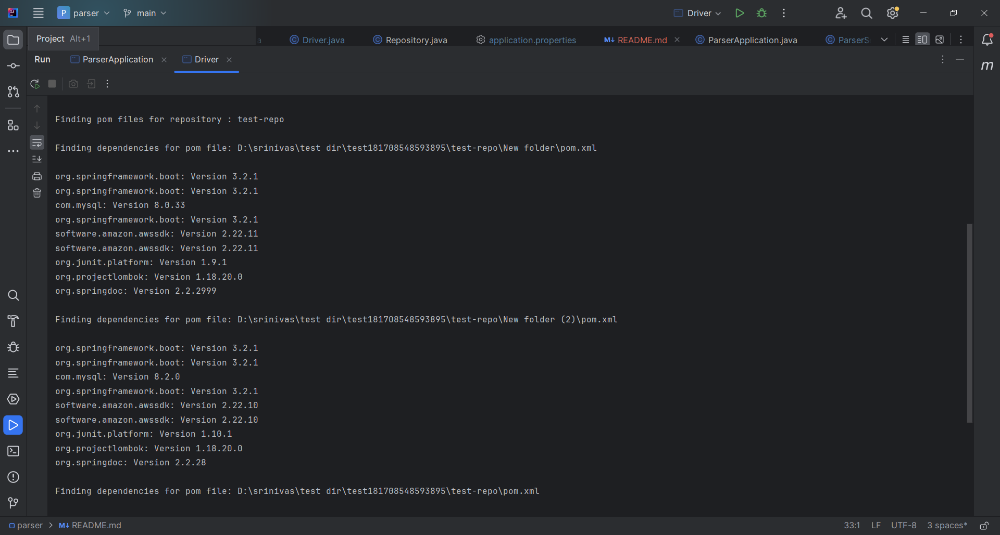
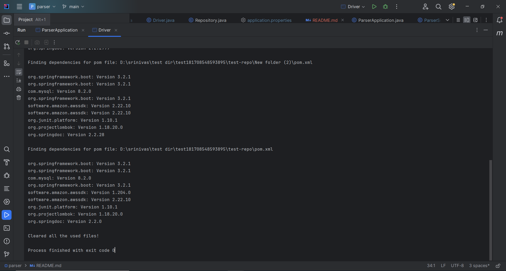

# Parser

This Spring Boot application was crafted for an assignment with the objective of developing a system capable of interfacing with GitHub's REST APIs. Its primary function is to analyze GitHub repositories and retrieve all dependencies associated with them, facilitating streamlined management and insight into project dependencies.

## Technologies Used:
- 	Java
- 	Spring Boot
-   Maven Model for working with pom file.
- 	GitHub Rest API for finding all the repositories under a GitHub account.
-   JGit for cloning the repositories

## Prerequisites

- Java Development Kit (JDK) 17
-	IntelliJ IDEA / Eclipse

## Steps to run the application
1. Clone or download the Spring Boot project from the repository (if not already available).    
   ```bash
   https://github.com/srinivasa8/parser.git
2.	Open the project using an IDE like IntelliJ IDEA, Eclipse, or Spring Tool Suite.
3. Using the terminal or within your IDE, execute mvn clean install to build the project and ensure the build completes successfully without any errors.
4. Locate the Driver file and replace the values for below variable.
    ```bash
          String localPath = "{LOCALPATH}";
          String apiKey = "{GITHUB_API_KEY}";
          String userName = "{GITHUB_USER_NAME}";
          String apiUrl = "{GITHUB_API_URL}";
   
5.	Run the driver class to start the application.
6.	Once the application runs, Please Check the console output for the output as shown below:

   

   

   


